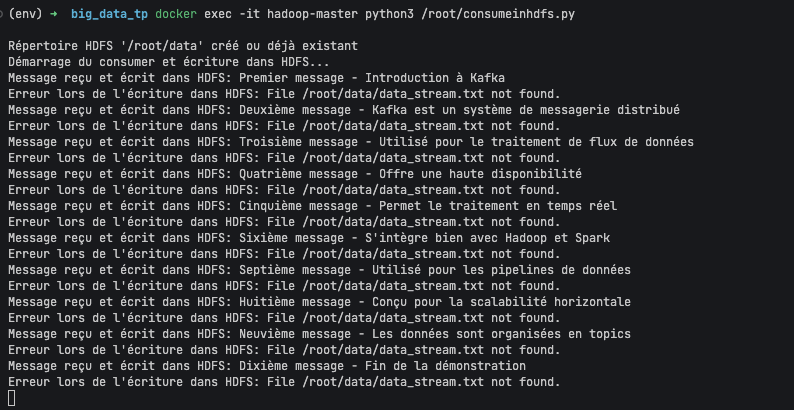

# TP Big Data : Kafka, HDFS et Spark

Ce TP permet de mettre en place un environnement Big Data complet avec Apache Kafka, Hadoop HDFS et Spark pour créer un pipeline de données simple mais fonctionnel.

## Objectifs
- Configurer un cluster Hadoop avec Docker
- Démarrer et utiliser Kafka pour la messagerie
- Produire et consommer des messages avec Kafka
- Stocker des données dans HDFS
- Analyser les données avec Spark

## Prérequis
- Docker installé sur votre machine
- VS Code (ou autre éditeur de code)
- Connaissances de base en Python

## Étape 1: Configuration de l'environnement Docker

Créez un nouveau projet VS Code nommé TP1BigData, puis lancez les commandes suivantes dans le terminal:

```bash
# Télécharger l'image Hadoop/Kafka
docker pull liliasfaxi/hadoop-cluster:latest

# Créer un réseau dédié pour les conteneurs
docker network create --driver=bridge hadoop

# Lancer le nœud master
docker run -itd --net=hadoop -p 9870:9870 -p 8088:8088 -p 7077:7077 -p 16010:16010 -p 9092:9092 --name hadoop-master --hostname hadoop-master liliasfaxi/hadoop-cluster:latest

# Lancer les nœuds workers
docker run -itd -p 8040:8042 --net=hadoop --name hadoop-worker1 --hostname hadoop-worker1 liliasfaxi/hadoop-cluster:latest
docker run -itd -p 8041:8042 --net=hadoop --name hadoop-worker2 --hostname hadoop-worker2 liliasfaxi/hadoop-cluster:latest
```

> **Note**: Ajouter le port 9092 au nœud master pour exposer Kafka


*Capture d'écran: Lancement des conteneurs Docker*

## Étape 2: Démarrage des services Hadoop et Kafka

Entrez dans le conteneur master et démarrez Hadoop:

```bash
# Entrer dans le conteneur master
docker exec -it hadoop-master bash

# Démarrer Hadoop
./start-hadoop.sh

# Vérifier les processus
jps
```

Démarrer Kafka:

```bash
./start-kafka-zookeeper.sh

# Vérifier les processus
jps
```


*Capture d'écran: Résultat de la commande jps montrant les processus Hadoop et Kafka*

## Étape 3: Production de messages Kafka

Utilisez le fichier `produce.py` fourni dans le répertoire pour produire une série de messages sur le topic data_stream.

Exécutez le script:

```bash
# Installer confluent-kafka si nécessaire
pip install confluent-kafka

# Exécuter le script
python produce.py
```


*Capture d'écran: Production de messages Kafka*

## Étape 4: Consommation de messages Kafka

Créez un script Python  pour lire les messages de Kafka:
Utilisez le fichier `final_consume_hdfs.py` pour consommer les messages produits par Kafka.


Exécutez le script:

```bash
python final_consume_hdfs.py
```


*Capture d'écran: Consommation de messages Kafka*

## Étape 5: Stockage des données dans HDFS

Créez un répertoire dans HDFS pour stocker les données:

```bash
hdfs dfs -mkdir -p /user/root/data
hdfs dfs -chmod -R 777 /user/root/data
```

Utilisez ensuite le fichier `consumeinhdfs.py` pour lire les messages Kafka et les écrire automatiquement dans un fichier sur HDFS.

Exécutez le script et produisez de nouveaux messages:

```bash
# Dans un terminal
python consumeinhdfs.py

# Dans un autre terminal
python produce.py
```

Vérifiez que les données ont bien été écrites dans HDFS:

```bash
hdfs dfs -cat /user/root/data/data_stream.txt
```


*Capture d'écran: Contenu du fichier dans HDFS*

## Étape 6: Analyse des données avec Spark

Lancez le fichier `countmessagespark.py` pour lire les données HDFS avec Spark et effectuer une première analyse (nombre de messages, mots les plus fréquents, etc.).

Exécutez le script:

```bash
python countmessagespark.py
```


*Capture d'écran: Résultat de l'analyse Spark*

## Résolution de problèmes courants

### Problème: Échec de connexion à Kafka
- Vérifiez que le port 9092 est bien exposé dans Docker
- Utilisez `localhost:9092` à l'intérieur du conteneur, mais l'adresse IP ou le nom d'hôte approprié depuis l'extérieur

### Problème: Échec d'écriture dans HDFS
- Vérifiez les chemins HDFS (ils ne correspondent pas aux chemins du système de fichiers local)
- Vérifiez les permissions des répertoires dans HDFS
- Utilisez les commandes HDFS pour créer des répertoires et vérifier les permissions

### Problème: Erreurs de taille avec Spark
Si vous rencontrez des erreurs de taille avec Spark, modifiez le fichier hdfs-site.xml:

```bash
nano $HADOOP_HOME/etc/hadoop/hdfs-site.xml
```

Ajoutez cette configuration:

```xml
<property>
  <name>dfs.blocksize</name>
  <value>1m</value>
  <description>Block size for HDFS</description>
</property>
```

## Conclusion

Ce TP vous a permis de mettre en place un pipeline de données complet avec les technologies Big Data les plus courantes. Vous avez appris à :
- Configurer et utiliser un cluster Hadoop via Docker
- Produire et consommer des messages avec Kafka
- Stocker des données dans HDFS
- Analyser des données avec Spark

Ces compétences sont essentielles pour travailler sur des projets Big Data dans des environnements professionnels.